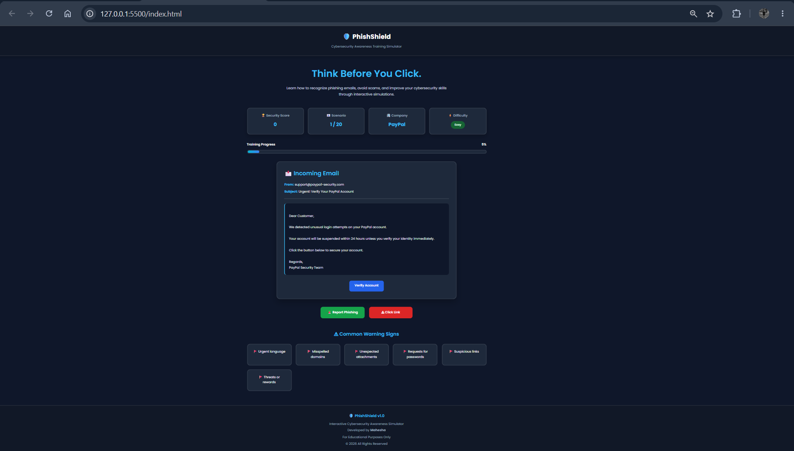
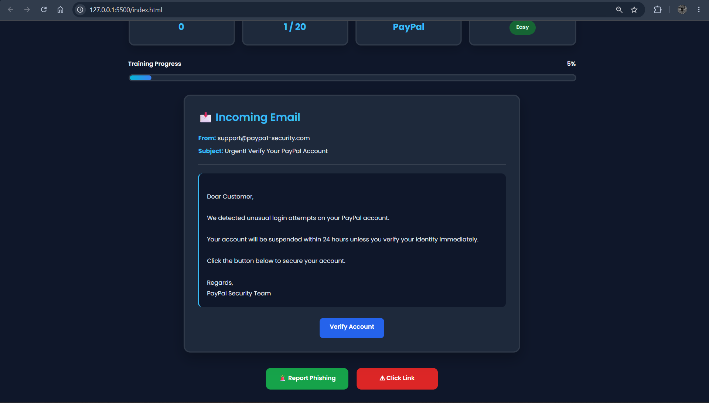
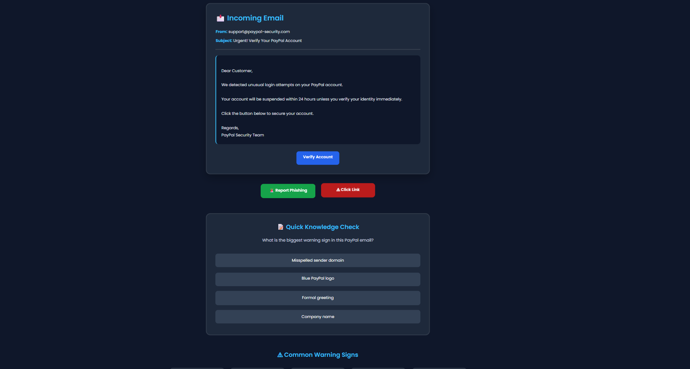
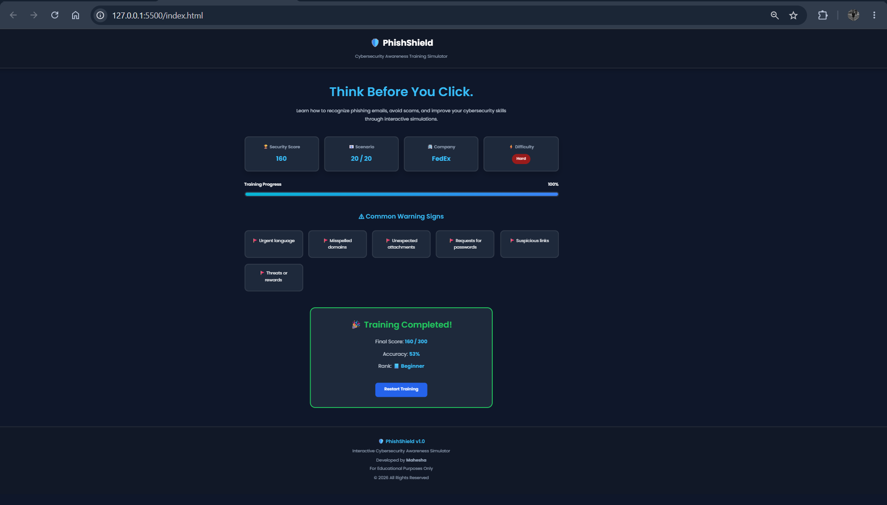
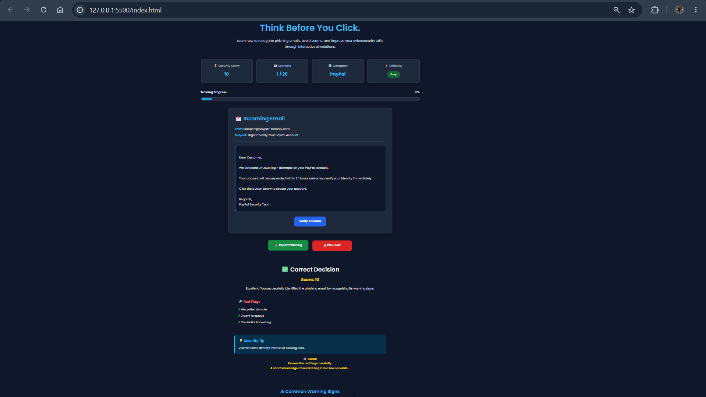

# 🛡️ PhishShield

An interactive cybersecurity awareness simulator designed to help users recognize phishing emails through realistic scenarios, instant feedback, quizzes, and security best practices.

---

## 📖 About the Project

PhishShield is an educational web application that provides a hands-on learning experience for identifying phishing attacks. Users are presented with simulated emails and must decide whether to report the email as phishing or interact with it. The application provides immediate feedback, highlights phishing indicators, offers security awareness tips, and reinforces learning with short quizzes.

This project was developed using **HTML**, **CSS**, and **JavaScript** as part of my cybersecurity learning journey.

---

## ✨ Features

- 📧 20 realistic phishing email scenarios
- 🚩 Phishing red flag identification
- ✅ Instant feedback on user decisions
- 🧠 Interactive cybersecurity quizzes
- 📊 Progress tracking
- 🏆 Dynamic scoring system
- 💡 Security awareness tips
- 🔄 Restart training functionality
- 📱 Responsive and user-friendly interface

---

## 🛠️ Technologies Used

- HTML5
- CSS3
- JavaScript (ES6)

---

## 📸 Screenshots

### Dashboard



---

### Email Simulation



---

### Quiz



---

### Training Completion



---

### Decision Feedback



---

## 🚀 Live Demo

Coming Soon

## (The project will be deployed using GitHub Pages.)

---

## ⚙️ Getting Started

Clone the repository:

```bash
git clone https://github.com/mahesha8097/PhishShield.git
```

Open the project folder and launch `index.html` in any modern web browser.

---

## 📂 Project Structure

```text
PhishShield/
│
├── assets/
├── index.html
├── style.css
├── script.js
├── scenarios.js
├── quiz.js
├── README.md
├── LICENSE
├── SECURITY.md
└── .gitignore
```

---

## 🎯 Learning Objectives

PhishShield helps users:

- Identify phishing emails
- Recognize suspicious links and urgent requests
- Understand common phishing techniques
- Improve cybersecurity awareness
- Develop safer email handling habits

---

## 🔮 Future Improvements

- AI-assisted phishing analysis
- Email header inspection
- User accounts and progress tracking
- Performance dashboard
- Certificate generation
- Difficulty levels
- Additional phishing scenarios
- Multi-language support

---

## 🤝 Contributing

Contributions, suggestions, and improvements are welcome.

Feel free to fork this repository and submit a pull request.

---

## 📄 License

This project is licensed under the MIT License.

---

## 👨‍💻 Author

### Mahesha

Cybersecurity Enthusiast

GitHub: <https://github.com/mahesha8097>

---

⭐ If you found this project useful, consider giving it a star!
